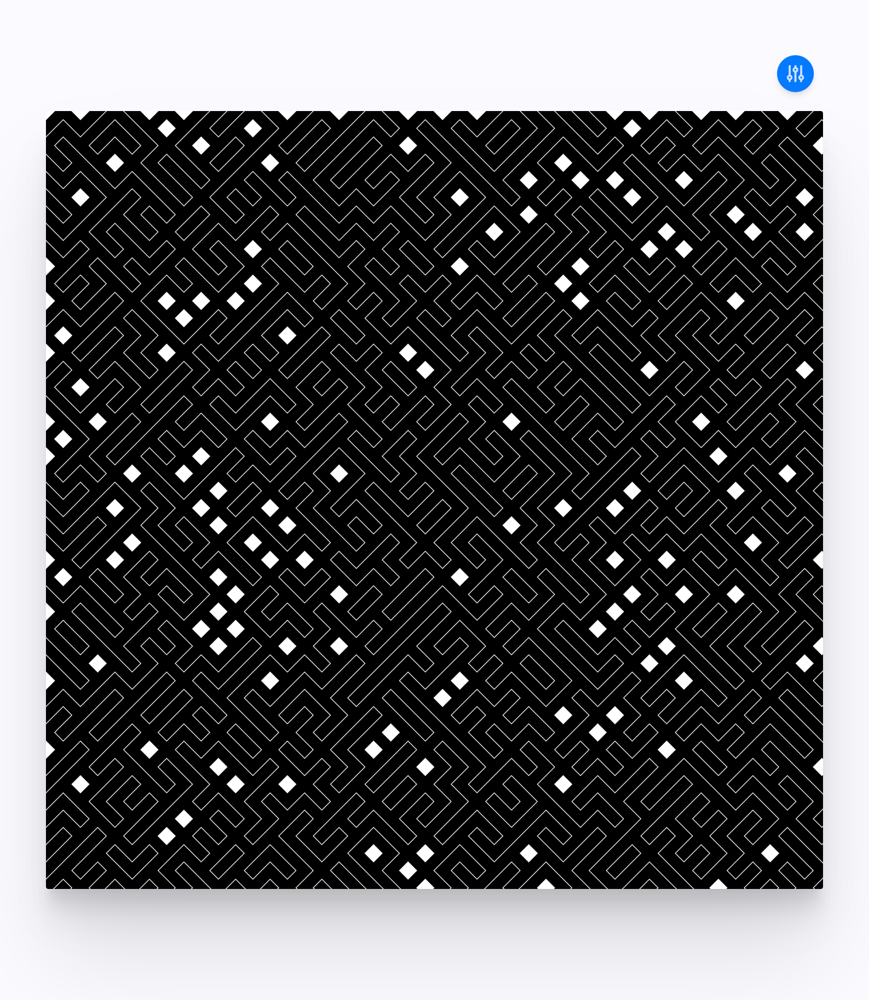

# gart

My simple generative art/creative coding environment built on sveltekit.



gart features:

- seeded pseudo random number generator
- GUI utils
- animation support with simple flag
- default hotkeys, with support to easily add your own (see below)
- basic starter composition based on https://generativeartistry.com/tutorials/tiled-lines/ (Thanks for the inspiration Ruth & Tim!)

Some built in hotkeys:

- [c] - execute your clear handler
- [r] - execute clearAndRun (clear handler then your run handler)
- [space] - pause animation frames
- [escape] - open/close GUI drawer
- [s] - (in sample only currently) regen a seed (aka, the next run will use new random numbers)

## Developing

Once you've created a project and installed dependencies with `pnpm install` start a development server with:

```bash
npm run dev

# or start the server and open the app in a new browser tab
npm run dev -- --open
```

The `--host` flag is useful if you want to "curate" on another device.
